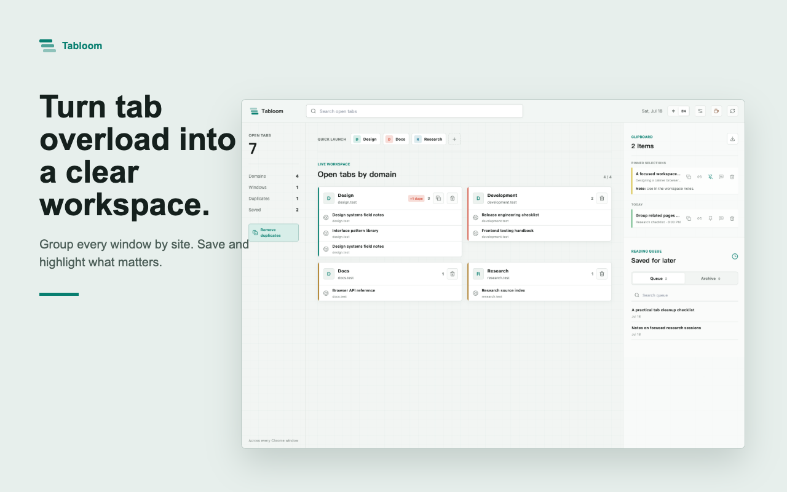
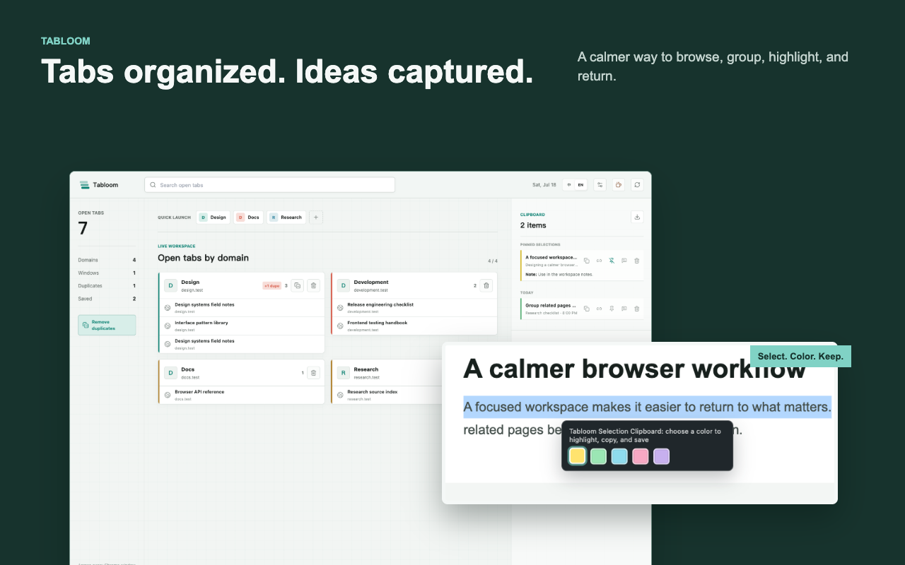
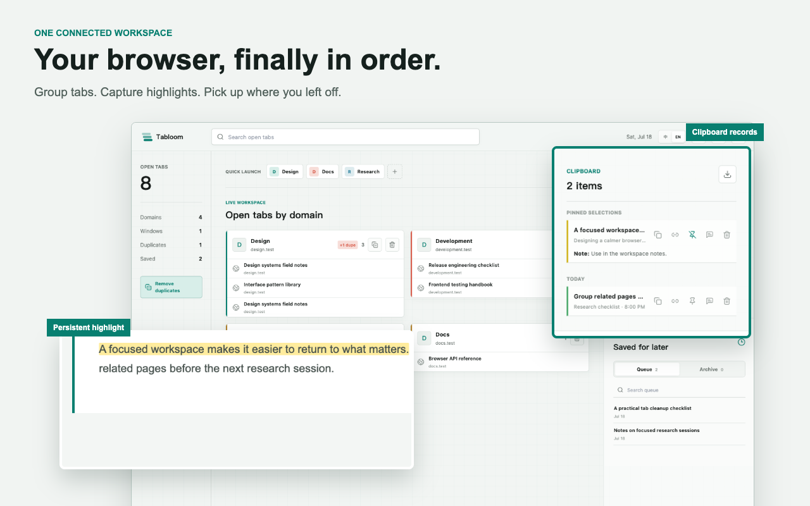

# Tabloom | 页序

> This public repository contains the packaged Chrome extension only. It does not contain Tabloom's private TypeScript or React source code.
>
> 本公开仓库仅包含可安装的 Chrome 扩展构建产物，不包含页序的私有 TypeScript 或 React 源码。

Tabloom is a new-tab command center that groups tabs by domain across every Chrome window, brings quick links, saved pages, and settings together, and keeps selected text in a private local clipboard.

页序是一个 Chrome 新标签页指挥中心：它按域名聚合所有窗口中的标签页，集中快捷入口、稍后阅读与设置，并用私密的本地划词剪切板保存重要内容。

## Install / 安装

### Chrome Web Store (recommended) / Chrome 应用商店（推荐）

[Install Tabloom from the Chrome Web Store / 从 Chrome 应用商店安装页序](https://chromewebstore.google.com/detail/ljhcfhoahkhngdmgpgpldaacdgimifbh?utm_source=item-share-cb)

Chrome Web Store review and rollout may lag behind the newest release. The latest packaged build is available from [GitHub Releases](https://github.com/cuiyuanS/Tabloom/releases).

Chrome 应用商店的审核与分批发布可能稍有延迟。如需最新打包版本，请前往 [GitHub Releases](https://github.com/cuiyuanS/Tabloom/releases)。

### Install the release ZIP / 安装 Release 压缩包

1. Download `tabloom-0.1.2-chrome-web-store.zip` from [GitHub Releases](https://github.com/cuiyuanS/Tabloom/releases) and extract it.
2. Open `chrome://extensions`, enable **Developer mode**, and click **Load unpacked**.
3. Select the extracted folder that directly contains `manifest.json`.

4. 从 [GitHub Releases](https://github.com/cuiyuanS/Tabloom/releases) 下载 `tabloom-0.1.2-chrome-web-store.zip` 并解压。
5. 打开 `chrome://extensions`，开启“开发者模式”，然后点击“加载已解压的扩展程序”。
6. 选择内部直接包含 `manifest.json` 的解压文件夹。

### Load this repository / 加载本仓库

As an unpacked fallback, download or clone this repository, open `chrome://extensions`, enable **Developer mode**, click **Load unpacked**, and select the repository root containing `manifest.json`.

作为备选方式，可下载或克隆本仓库，打开 `chrome://extensions`，开启“开发者模式”，点击“加载已解压的扩展程序”，并选择直接包含 `manifest.json` 的仓库根目录。

## Product / 产品

### 中文功能

- 按域名聚合所有 Chrome 窗口中的标签页，跨窗口跳转，检测重复页面，并关闭单个标签页或整组页面。
- 在新标签页指挥中心集中使用域名分组、快捷入口、稍后阅读队列与归档、剪切板历史和统一设置。
- 自动整理新打开标签页与闲置 30 分钟后自动释放内存均为可选功能，默认关闭；也可设置忽略域名、禁止分组域名和自定义组名。
- 在普通 HTTP/HTTPS 网页上划词，选择颜色后自动高亮、复制并保存到本地剪切板。
- 重新打开同一完整网址时会尽力恢复高亮；网页结构变化后可能无法恢复，但历史记录仍会保留。
- 按今天、昨天和具体日期查看历史，删除记录、撤销删除、跳转来源页，或一键再次复制。
- 最多置顶 5 条记录；可添加本地备注，或复制“划词 + 页面标题 + 来源网址”。
- 在浏览器本地导出 Markdown 或完整 JSON 备份。
- 支持中英文界面、明暗模式、四套强调色，并保留 localhost 端口以区分本地项目。

### English features

- Group tabs by domain across every Chrome window, jump to an existing tab, find exact duplicates, and close one tab or a complete group.
- Use the new-tab command center for domain groups, quick links, the saved-for-later queue and archive, full clipboard history, and immediate settings access.
- Automatic grouping of newly opened tabs and automatic memory release after 30 minutes of inactivity are optional and off by default. Ignored domains, blocked domains, and custom group names are configurable.
- Select text on ordinary HTTP/HTTPS pages, choose a color, and automatically highlight, copy, and save it in the local clipboard.
- Tabloom makes a best-effort attempt to restore highlights when the exact URL is revisited. Restoration may fail after the page structure changes, while the history record remains available.
- Browse history by Today, Yesterday, or date; delete a record, undo deletion, return to its source, or copy it again with one click.
- Pin up to five records, add private local notes, and copy a selection together with its page title and source URL.
- Export Markdown or a complete JSON backup locally in the browser.
- Use English or Simplified Chinese, follow the browser's light or dark appearance, choose among four accent palettes, and keep localhost ports visible.

## Privacy / 隐私

Tabloom has no author-operated backend and does not send browsing history, tab titles, URLs, or clipboard records to the author. Settings, quick links, and saved pages use `chrome.storage.sync`; Chrome may synchronize that data according to the user's Chrome account settings. Automatic-discard activity timestamps stay in session-only `chrome.storage.session`.

The selection clipboard stores selected text, page titles, source URLs, colors, timestamps, notes, and optional highlight anchors only in `chrome.storage.local`. It keeps at most 500 records, does not use Chrome Sync, and does not upload them to an external service. Markdown and JSON exports are generated locally. Clipboard behavior is limited to ordinary HTTP/HTTPS pages and excludes inputs, textareas, and editable regions.

页序没有作者运营的后端，不会向作者发送浏览历史、标签页标题、网址或剪切板记录。设置、快捷入口与稍后阅读数据使用 `chrome.storage.sync`，Chrome 可能根据用户的账号设置同步这些数据。自动释放内存的活动时间仅保存在当前会话的 `chrome.storage.session` 中。

划词剪切板使用 `chrome.storage.local` 仅在本机保存所选文字、页面标题、来源网址、颜色、时间、备注与可选高亮锚点，最多 500 条，不参与 Chrome 同步，也不会上传到外部服务。Markdown 和 JSON 导出也在浏览器本地生成。剪切板功能仅适用于普通 HTTP/HTTPS 页面，并排除输入框、文本域和可编辑区域。
